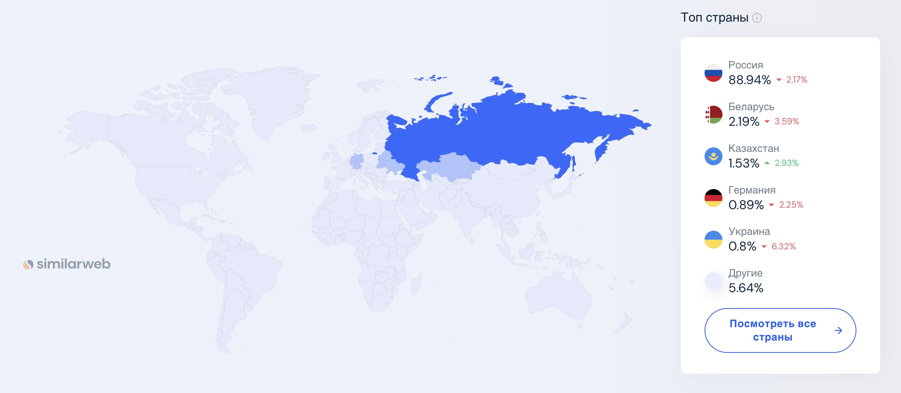
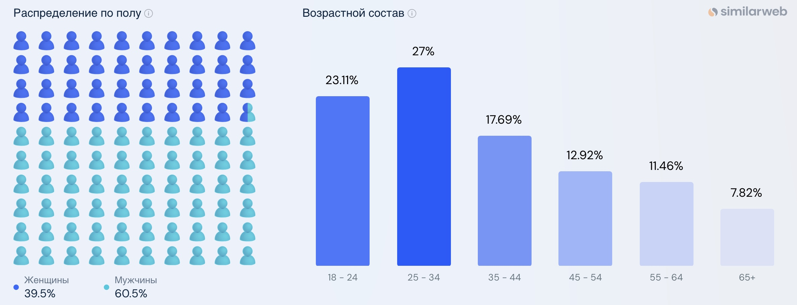

# VK

## 1. Тема и целевая аудитория

### Тема

**ВКонтакте (VK)** – крупнейшая в России социальная сеть.

### Целевая аудитория

- Средняя месячная аудитория (MAU) составляет 126 млн в месяц [^3]
- Средняя месячная аудитория в России (MAU) составляет 90 млн в месяц [^4]
- Средняя дневная аудитория (DAU) в России составляет 56,5 млн пользователей [^2]
- 52% трафика официального сайта ВК проходит через мобильные устройства [^1]
- Во ВКонтакте зарегистрировано 22,4 млн авторов [^5]
- Пользователи ВКонтакте проводят в социальной сети в среднем 129 минут в день (по данным на 2023 год) [^6]
- По данным на конец 2023 года пользователи ВКонтакте отправляют 395 млн заявок в друзья в месяц [^7]
- У женщин обычно больше друзей: в среднем — 132, тогда как у мужчин — 111. То есть в среднем у пользователя ВКонтакте 121,5 друг [^7]
- В 2024 году во ВКонтакте было опубликовано 7,6 миллиардов единиц контента (посты, клипы, видео, истории) [^8]
- В среднем сообщество во ВКонтакте в 2024 году выпускало 71,16 поста в месяц (без учета VK Видео и VK Клипов) [^9]
- В среднем пользователь ВКонтакте публикует в месяц 16,9 сообщений [^12]
- Посты с картинками смотрят 64% пользователей ВКонтакте (по данным на 2024 год) [^10]
- В среднем активный пользователь подписан на 121 сообщество [^11]
- 68% пользователей смотрят контент в ленте [^11]
- 64% пользователей смотрят контент в сообществах [^11]
- Средний Visibility Rate на пост в 2024-м — 17,27% [^13]

### Веб-трафик по странам 

 [^1]

### Демографические показатели аудитории

 [^1]

### MVP

**Ключевой функционал** - просмотр новостной ленты пользователя
- Регистрация и авторизация пользователей
- Публикация постов на странице пользователя (текст, фото, видео)
- Добавление пользователей в друзья
- Создание сообществ, в которые могут вступать пользователи
- Публикация постов на странице сообщества (текст, фото, видео)
- Просмотр страниц пользователя и сообществ
- Возможность ставить лайки на пост от лица пользователя
- Комментарии под постами от лица пользователя

## Список источников

[^1]: [Анализ трафика vk.com от simularweb](https://www.similarweb.com/ru/website/vk.com/#overview)

[^2]: [Исследование аудитории крупнейших социальных сетей в России в 2025 году](https://ppc.world/articles/auditoriya-vosmi-krupneyshih-socsetey-v-rossii-issledovaniya-i-cifry/)

[^3]: [Пост ВК со статистикой за 2024](https://vk.com/wall-22822305_1575041)

[^4]: [Статистика ВКонтакте от inclient](https://inclient.ru/vk-stats/)

[^5]: [Исследование brand analytics](https://vk.com/press/brand-analytics-october-2024)

[^6]: [Исследование ВЦИОМ](https://wciom.ru/analytical-reviews/analiticheskii-obzor/socialnye-seti-i-messendzhery-vovlechennost-i-predpochtenija)

[^7]: [Исследование дружбы ВКонтакте](https://vk.com/press/friends-research)

[^8]: [Итоги 2024 года ВКонтакте: контент](https://m.vk.com/press/content-2024)

[^9]: [Независимое исследование ВКонтакте от «Студии Чижова», LiveDune и TargetHunter](https://dzen.ru/a/Z4931DOF_D_ajSrJ)

[^10]: [Главные тренды потребления контента во ВКонтакте](https://ppc.world/news/glavnye-trendy-potrebleniya-kontenta-vo-vkontakte-issledovanie/)

[^11]: [Исследование трендов ВКонтакте](https://vk.com/press/trends-2024)

[^12]: [Исследование brand analytics](https://brandanalytics.ru/blog/social-media-russia-autumn-2024)

[^13]: [Независимое исследование ВКонтакте от «Студии Чижова», LiveDune и TargetHunter](https://targethunter.ru/blog/bolshoe-nezavisimoe-issledovanie-vkontakte-2024-reklama-ohvaty-vovlechennost/?ysclid=m7c68zp3a6795536690)
