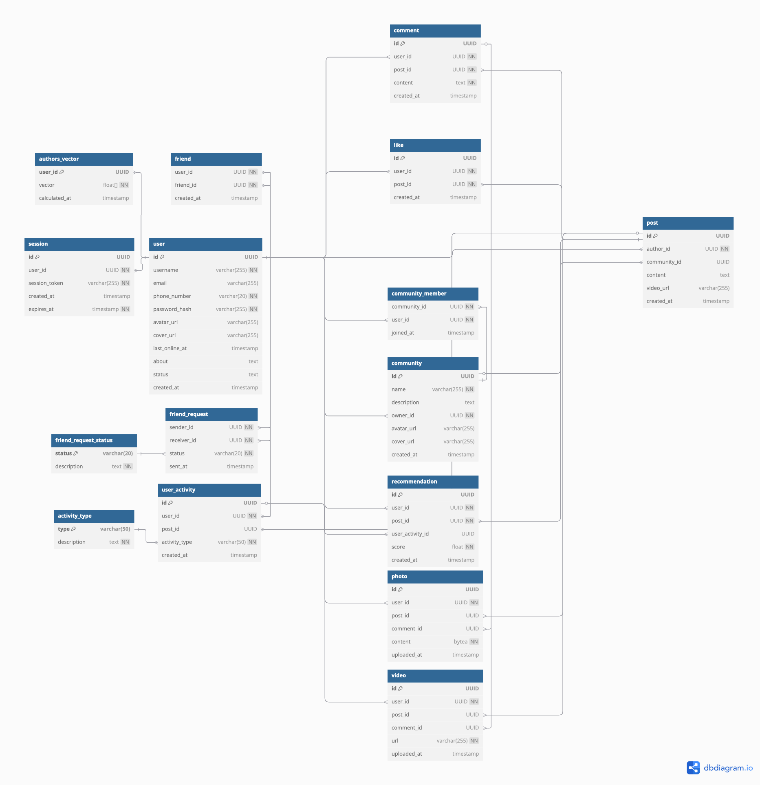

# VK

## Содержание
  ### [1. Тема и целевая аудитория](#topic)
  ### [2. Расчет нагрузки](#load)
  ### [3. Глобальная балансировка нагрузки](#balancing)
  ### [4. Локальная балансировка нагрузки](#local_balancing)
  ### [5. Логическая схема БД](#logic_scheme_db)
  ### [6. Физическая схема БД](#physical_db)
  ### [7. Алгоритмы](#algorithms)
  ### [Список источников](#sources)

## 1. Тема и целевая аудитория

### Тема

**ВКонтакте (VK)** – крупнейшая в России социальная сеть.

### Целевая аудитория

- Средняя месячная аудитория (MAU) составляет 126 млн в месяц [^3]
- Средняя месячная аудитория в России (MAU) составляет 90 млн в месяц [^4]
- Средняя дневная аудитория (DAU) в России составляет 56,5 млн пользователей [^18]
- Во ВКонтакте зарегистрировано 22,4 млн авторов [^5]
- Пользователи ВКонтакте проводят в социальной сети в среднем 45 минут в день (по данным на 2024 год) [^6]
- По данным на конец 2023 года пользователи ВКонтакте отправляют 395 млн заявок в друзья в месяц [^7]
- У женщин обычно больше друзей: в среднем — 132, тогда как у мужчин — 111. То есть в среднем у пользователя ВКонтакте 121,5 друг [^7]
- В 2024 году во ВКонтакте было опубликовано 7,6 миллиардов единиц контента (посты, клипы, видео, истории) [^8]
- В среднем сообщество во ВКонтакте в 2024 году выпускало 71,16 поста в месяц (без учета VK Видео и VK Клипов) [^9]
- В среднем пользователь ВКонтакте публикует в месяц 16,9 сообщений [^12]
- Посты с картинками смотрят 64% пользователей ВКонтакте (по данным на 2024 год) [^10]
- В среднем активный пользователь подписан на 121 сообщество [^11]
- 68% пользователей смотрят контент в ленте [^11]
- 64% пользователей смотрят контент в сообществах [^11]
- Средний Visibility Rate на пост в 2024-м — 17,27% [^13]
- 1 млрд лайков в сутки на 2022 год [^15]
- Количество просмотров разных видов контента: 10,3 млрд в сутки (на 2022 год) [^14]

### Веб-трафик по странам 

 [^1]

### MVP

**Ключевой функционал** - просмотр новостной ленты пользователя
- Регистрация и авторизация пользователей
- Публикация постов на странице пользователя (текст, фото, видео)
- Добавление пользователей в друзья
- Создание сообществ, в которые могут вступать пользователи
- Публикация постов на странице сообщества (текст, фото, видео)
- Просмотр страниц пользователя и сообществ
- Возможность ставить лайки на пост от лица пользователя
- Комментарии под постами от лица пользователя
- Система рекомендаций постов в ленте пользователя, основанная на просмотренных постах, лайках, комментариях пользователя

## 2. Расчет нагрузки 

### Продуктовые метрики

Средняя дневная аудитория (DAU) в России составляет 56,5 млн пользователей [^2]. 88.94% аудитории ВКонтакте из России [^1]. Тогда общий DAU: 56,5 : 0,8894 = 63,53 млн чел в день.

Во Вконтакте для аккаунтов используется инкрементальный ID. Для созданного 23.03.2025 аккаунта был присвоен ID 1037738069. Предполагаем, что за все время с момента создания ВКонтакте было зарегистрировано 1 037 738 069 пользователей (включая заблокированные и удаленные аккаунты, данные которых во ВКонтакте не удаляются полностью).

| Характеристика                  | Значение                 |
|---------------------------------|--------------------------|
| MAU                             | 126 млн [^3]             |
| DAU                             | 63,53 млн                |
| Зарегистрированные пользователи | 1 037,7 млн              |    

В среднем пользователь ВКонтакте публикует в месяц 16,9 сообщений [^12]. Тогда в день это примерно 16,9 : 30 = 0,56 сообщения. Тогда все пользователи в месяц публикуют 16,9 * 126 = 2 129,4 млн постов.

В среднем сообщество во ВКонтакте выпускает 71,16 поста в месяц [^9]. Тогда в день это примерно 71,16 : 30 = 2,37 поста. На всех пользователей в месяц это 71,16 * 126 = 8 966,16 млн в месяц.

Пользователи ВКонтакте отправляют 395 млн заявок в друзья в месяц [^7]. Поделим на MAU, чтобы получить примерную статистику для 1 пользователя в месяц. 395 млн : 126 млн = 3,135 заявок в друзья в месяц делает 1 пользователь. Тогда в день это примерно 3,135 : 30 = 0,1 заявка.

Количество просмотров разных видов контента в социальной сети в 2022-м достигло показателя 10,3 млрд в сутки [^14]. DAU на 2022 год в России составлял 51,1 млн, на 2024 год в России - 56,5 млн. То есть DAU увеличился на 10,6%. Предположим, что количество просмотра контента увеличивается пропорционально DAU, тогда в сутки в 2024 эта цифра предположительно будет равна 10,3 млрд * 1,106 = 11,4 млрд в сутки. Поделим на DAU, чтобы узнать статистику на одного пользователя. 11,4 млрд : 63,53 млн = 179,4 просмотра на одного пользователя в сутки.

Бесконечная лента прогружается по 15 постов в чанке (включая рекламные посты). Тогда запросов на обновление ленты на 1 пользователя 179,4 : 15 = 11,96.

1 млрд лайков в сутки на 2022 год [^15]. DAU на 2022 год в России составлял 51,1 млн, на 2024 год в России - 56,5 млн. То есть DAU увеличился на 10,6%. Предположим, что количество лайков увеличивается пропорционально DAU, тогда в сутки в 2024 эта цифра предположительно будет равна 1 млрд * 1,106 = 1,106 млрд в сутки. Поделим на DAU, чтобы узнать статистику на одного пользователя. 1,106 млрд : 63,53 млн = 17,4 лайка на одного пользователя в сутки.

Данные по комментариям отсутствуют. Был проведен анализ на небольшой выборке постов из ленты ВК [^16]. Коэффициент корреляции лайков к комментариям получился 0,11. Это говорит о слабой связности данных. Но в виду отсутствия других данных возьмем получившиеся результаты: число комментариев в 26,5 раз меньше, чем лайков. Тогда в сутки это 17,4 : 26,5 = 0,66 комментария.

В среднем у пользователя ВКонтакте 121,5 друг [^7]. В среднем активный пользователь подписан на 121 сообщество [^11]. Можно предположить, что подписок на сообщества оформляется примерно столько же, сколько отправляется заявок в друзья. Примем это число за 0,1 подписки в сутки.

| Действие пользователя                 | Количество в день на 1 пользователя | Количество в месяц на 1 пользователя | Количество в месяц на всех пользователей |
|---------------------------------------|-------------------------------------|--------------------------------------|------------------------------------------|
| Публикация поста от лица пользователя | 0,56                                | 16,9                                 | 2 129 400 000                            |
| Публикация поста от лица сообщества   | 2,37                                | 71,16                                | 8 966 160 000                            |
| Отправка заявки в друзья              | 0,1                                 | 3,135                                | 395 000 000                              |
| Просмотр поста                        | 179,4                               | 5 383,3                              | 342 000 000 000                          |
| Запросов на обновление ленты          | 11,96                               | 358,9                                | 22 800 000 000                           |
| Лайк на пост                          | 17,4                                | 522,3                                | 33 180 000 000                           |
| Комментарий                           | 0,66                                | 19,7                                 | 1 252 075 472                            |
| Подписка на сообщество                | 0,1                                 | 3,135                                | 395 000 000                              |

#### Хранилище на одного пользователя

- Для аватарки и обложки учитываем максимально допустимый размер [^17]
- Средний размер фотографии - 2,2 МБ. Был проведен анализ небольшого количества пользователей [^16], в среднем у пользователя 188,4 фотографии. Тогда около 414,48 МБ занимают фотографии в профиле
- Был проведен анализ небольшого количества пользователей [^16], в среднем у пользователя 76,9 видео, видео хранятся ссылкой на vkvideo. На хранение одной ссылки нужно 100 байт, тогда всего надо 7690 байт=~0,007 МБ
- Был проведен анализ небольшого количества пользователей [^16], в среднем у пользователя 191,76 постов, содержащих текст. Один символ кодируется 1 байтом, в среднем в одном посте 250 символов. Тогда это около 250 * 191,76 = 47 940 байт = 0,046 МБ
- В среднем у пользователя 121,5 друг. На хранение подписки на друга нужно около 20 байт. 20 * 121,5 = 2 430 байт = 0,0023 МБ
- В среднем пользователь подписан на 121 сообщество. На хранение подписки на сообщество нужно около 20 байт. 20 * 121 = 2 420 байт = 0,0023 МБ
- В месяц пользователь ставит 522,3 лайка. В год это будет уже 6267,6 лайков. Если принять время активной жизни аккаунта за 4 года, то в среднем на пользователя надо хранить около 6267,6 * 4 = 25 070,4 лайков. На хранение лайка нужно около 20 байт. 20 * 25 070,4 = 501 408 байт = 0,48 МБ

| Тип данных                          | Размер     | Количество |
|-------------------------------------|------------|------------|
| Аватарка                            | 5 МБ       | 1          |
| Обложка                             | 20 МБ      | 1          |
| Текстовая информация о пользователе | ~0,003 МБ  | 1          |
| Опубликованные фото                 | 414,48 МБ  | 188,4      |
| Опубликованные видео                | ~0,007 МБ  | 76,9       |
| Опубликованные текстовые посты      | 0,046 МБ   | 191,76     |
| Подписки на друзей                  | 0,0023 МБ  | 121,5      |
| Подписки на сообщества              | 0,0023 МБ  | 121        |
| Лайки                               | 0,48 МБ    | 25 070,4   |
| Итого                               | 440,02 МБ  |            |

### Технические метрики

#### Размер хранилища

- ВКонтакте был запущен в 2006 году. То есть ВКонтакте функционирует уже 19 лет. За это время было выпущено около 1 500 млрд постов.
- В месяц публикуется 71,16 + 16,9 = 88,06 постов [^9] [^12]. Умножим на MAU: 88,06 * 126 = 11 095,56 млн постов в месяц
- Размер одного поста с фото 5 КБ (аватарка) + 2252,8 КБ (фотография) + 0,1 КБ (небольшая подпись) = 2257,9 КБ. Постов с фото 64%. 0,64 * 11 095,56 = 7 101,158 млн постов с фото в месяц. Это 7 101,158 * 2257,9 = 16 033 065,544 млн КБ в месяц = 14 931 ТБ в месяц. За все время это примерно 0,64 * 1 500 = 960 млрд постов. 960 000 000 000 * 2257,9 = 2 167 584 млрд КБ = 2 018 719,9 ТБ
- Размер одного поста с видео 5 КБ (аватарка) + 0,1 КБ (видео ссылкой) + 0,1 КБ (небольшая подпись) = 5,2 КБ. Постов с видео 20%. 0,2 * 11 095,56 = 2 219,112 млн постов с видео в месяц. Это 2 219 112 000 * 5,2 = 1,154×10¹⁰ КБ в месяц = 10,75 ТБ в месяц. За все время это примерно 0,2 * 1 500 = 300 млрд постов. 300 000 000 000 * 5,2 = 1 560 млрд КБ = 1 452,86 ТБ
- Размер одного текстового поста 5 КБ (аватарка) + 0,5 КБ = 5,5 КБ. Текстовых постов 16%. 0,16 * 11 095,56 = 1 775,29 млн постов с текстом в месяц. Это 1 775 290 000 * 5,5 = 9 764 095 000 КБ в месяц = 9,09 ТБ в месяц. За все время это примерно 0,16 * 1 500 = 240 млрд постов. 240 000 000 000 * 5,5 = 1 320 млрд КБ = 1 229,35 ТБ
- Данные одного пользователя без постов: 25,5 МБ. Допутим, что в месяц мы бы хранили данные активных пользователей: 25,5 * 126 000 000 = 3 213 000 000 МБ = 3 064,1 ТБ. За все время во ВКонтакте было зарегистрировано около 1 037,7 млн пользователей, около 30% - пустые/неактивные/заблокированные/удаленные аккаунты. Тогда активных аккаунтов 1 037 700 000 * 0,7 = 726 390 000. Тогда за все время это около 25,5 * 726 390 000 = 18 522 945 000 МБ = 17 664,86 ТБ  

| Тип                  | Объем в ТБ на месяц | Общий объем в ТБ |
|----------------------|---------------------|------------------|
| Текстовые посты      | 9,09                | 1 229,35         |
| Посты с фото         | 14 931              | 2 018 719,9      |
| Посты с видео        | 10,75               | 1 452,86         |
| Данные пользователей | 3 064,1             | 17 664,86        |
| Всего                | 18 014,94           | 2 039 066,97     |

#### RPS

Формула: (количество запросов в день от одного пользователя * DAU) / 86400 секунд

- Публикация поста от лица пользователя: (0,56 * 63530000) / 86400 = 412 
- Публикация поста от лица сообщества: (2,37 * 63530000) / 86400 = 1 743 
- Отправка заявки в друзья: (0,1 * 63530000) / 86400 = 74
- Запрос на обновление ленты: (11,96 * 63530000) / 86400 = 8 794 
- Лайк на пост: (17,4 * 63530000) / 86400 = 12 794 
- Комментарий: (0,66 * 63530000) / 86400 = 485 
- Подписка на сообщество: (0,1 * 63530000) / 86400 = 74

Ввиду отсутствия данных считаем, что пиковое значение RPS в 2 раза больше среднего.

| Тип запроса                           | Средний RPS | Пиковый RPS |
|---------------------------------------|-------------|-------------|
| Публикация поста от лица пользователя | 412         | 824         |
| Публикация поста от лица сообщества   | 1 743       | 3 486       |
| Отправка заявки в друзья              | 74          | 148         |
| Запрос на обновление ленты            | 8 794       | 17 588      |
| Лайк на пост                          | 12 794      | 25 588      |
| Комментарий                           | 485         | 970         |
| Подписка на сообщество                | 74          | 148         |
| Итого                                 | 24 376      | 48 752      |

#### Сетевой трафик

Формула: трафик на действие * RPS

- Лайк: 18 * 12 794 = 230 292 КБ/с = 1,76 Гбит/с. Пиковое: 1,76 * 2 = 3,52 Гбит/с. Суммарный суточный: 1,76 * 86400 * 0,125 = 19 008 Гбайт/сутки
- Проверка комментария: 897 * 485 = 435 045 байт/с = 0,003 Гбит/с. Пиковое: 0,003 * 2 = 0,006 Гбит/с. Суммарный суточный: 0,003 * 86400 * 0,125 = 32,4 Гбайт/сутки
- Комментарий: 9,7 * 485 = 4 704,5 КБ/с = 0,036 Гбит/с. Пиковое: 0,036 * 2 = 0,072 Гбит/с. Суммарный суточный: 0,036 * 86400 * 0,125 = 388,8 Гбайт/сутки
- Прогрузка одной страницы в ленте: 1,4 * 8 794 = 12 311,6 МБ/с = 96,18 Гбит/с. Пиковое: 96,18 * 2 = 192,36 Гбит/с. Суммарный суточный: 96,18 * 86400 * 0,125 = 1 038 744 Гбайт/сутки
- Публикация поста: 29 * 2 155 = 62 495 КБ/с = 0,48 Гбит/с. Пиковое: 0,48 * 2 = 0,96 Гбит/с. Суммарный суточный: 0,48 * 86400 * 0,125 = 5 184 Гбайт/сутки
- Отправка заявки в друзья: 724 * 74 = 53 576 байт/с = 0,0004 Гбит/с. Пиковое: 0,0004 * 2 = 0,0008 Гбит/с. Суммарный суточный: 0,0004 * 86400 * 0,125 = 4,32 Гбайт/сутки
- Подписка на сообщество: 35,5 * 74 = 2 627 КБ/с = 0,02 Гбит/с. Пиковое: 0,02 * 2 = 0,04 Гбит/с. Суммарный суточный: 0,02 * 86400 * 0,125 = 216 Гбайт/сутки

| Действие                         | Трафик на действие | Время на действие | Ср RPS | Ср потребление Гбит/с | Пик RPS | Пиковое потребление Гбит/с | Суммарный суточный трафик Гбайт/сутки |
|----------------------------------|--------------------|-------------------|--------|-----------------------|---------|----------------------------|---------------------------------------|
| Лайк                             | 18 КБ              | 220 мс            | 12 794 | 1,76                  | 25 588  | 3,52                       | 19 008                                |
| Проверка комментария             | 897 байт           | 60 мс             | 485    | 0,003                 | 970     | 0,006                      | 32,4                                  |
| Комментарий                      | 9,7 КБ             | 740 мc            | 485    | 0,036                 | 970     | 0,072                      | 388,8                                 |
| Прогрузка одной страницы в ленте | 1,4 МБ             | 1000 мс           | 8 794  | 96,18                 | 17 588  | 192,36                     | 1 038 744                             |
| Публикация поста                 | 29 КБ              | 150 мс            | 2 155  | 0,48                  | 4 310   | 0,96                       | 5 184                                 |
| Отправка заявки в друзья         | 724 байт           | 268 мс            | 74     | 0,0004                | 148     | 0,0008                     | 4,32                                  |
| Подписка на сообщество           | 35,5 КБ            | 383 мс            | 74     | 0,02                  | 148     | 0,04                       | 216                                   |
| **Итого**                        |                    |                   | 24 861 | 98,48                 | 49 722  | 196,96                     | 1 063 577,52                          |

- Просмотр поста c видео: постов с видео 20% от всех постов. За каждую секунду видео отправляется 4 запроса, среднее видео длится 60 секунд. (179,4 * 0,2 * 60 * 4 * 63530000) / 86400 = 6 331 823,333 запросов в секунду на просмотр видео.
- Один запрос на просмотр видео = 730 байт.
- Среднее потребление Гбит/с: 730 * 6 331 823,333 = 4 622 231 033,09 байт/с = 34,44 Гбит/с
- Пиковое потребление Гбит/с: 34,44 * 2 = 68,88 Гбит/с
- Суммарный суточный трафик Гбайт/сутки: 34,44 * 86400 * 0,125 = 371 952 Гбайт/сутки

## 3. Глобальная балансировка нагрузки

### Функциональное разбиение по доменам

- Основной домен (точка входа, авторизация, роутинг): vk.com
- Мобильная версия: m.vk.com
- Отдача динамического контента: api.vk.com
- Отдача статического контента: stY-XX.vk.com (где Y - номер группы серверов, XX - номер конкретного сервера)
- Отдача медиаконтента: sunY-XX.userapi.com (где Y - номер группы серверов, XX - номер конкретного сервера)
- Внешняя зависимость (хранение и отдача видеоконтента): vkvideo.ru

### Расположение датацентров

Основная аудитория ВКонтакте находится в РФ (88,94%) [^1], следовательно датацентры рационально будет расположить тоже в РФ.

Исходя из карты распределения плотности населения РФ [^19], наибольшая плотность населения наблюдается в европейской части РФ. Предполагаем, что нагрузка больше там, где выше плотность населения (чем больше людей, тем больше среди них пользователей ВКонтакте => больше RPS в этой области). Следовательно наибольшая часть датацентров должны располагаться в европейской части РФ.

 [^19]

Обратим внимание на города, которые находятся на пересечении нескольких крупных магистральных сетей связи [^21]. Расположение датацентров в таких городах поможет снизить latency, обеспечить более высокую пропускную способность.

 [^21]

#### Месторасположение датацентров:

Основной домен **vk.com** и домен для отдачи динамического контента **api.vk.com** будут располагаться в **Москве**. Именно в Москве и вокруг нее находится наибольшая концентрация пользователей. 

- stY-XX.vk.com → CDN для статики
- sunY-XX.userapi.com → CDN для пользовательского медиаконтента

Распределение доменов CDN:

- Москва (крупнейший город РФ по численности населения => высокая концентрация пользователей. Также может обслуживать небольшой трафик с Белоруссии, Германии)
- Санкт-Петербург (второй крупнейший город РФ по численности населения => высокая концентрация пользователей)
- Ростов-на-Дону (обслуживает юго-западную густозаселенную часть РФ. Также может обслуживать небольшой трафик с Белоруссии, Германии)
- Екатеринбург (Обслуживает центральную часть РФ. Также может обслуживать небольшой трафик с Казахстана)
- Новосибирск (обслуживает восточную часть РФ)

### Расчет распределения запросов

Исходя из плотности населения и региональной структуры пользователей, распределение нагрузки можно оценить следующим образом:

- Москва: весь трафик API + 25% трафика CDN
- Санкт-Петербург: 15% трафика CDN
- Ростов-на-Дону: 20% трафика CDN
- Екатеринбург: 25% трафика CDN
- Новосибирск: 15% трафика CDN

8 794 запросов на обновление ленты => 8 794 * 15 = 131 910 постов в секунду => 131 910 * 0,64 = 84 422,4 постов с медиаконтентом запрашивают каждую секунду. Пусть около 20% медиа кэшируются. Тогда запросов медиа будет 84 422,4 * 0,8 = 67 537,92 

При первичном открытии страницы подгружается около 100 файлов статики. Статика кэшируется на 4 суток. Допустим, что 10% запросов требует подгрузку статики. 100 * 8 794 * 0,1 = 87 940  

Тогда распределение нагрузки будет следующим:

| Тип запроса                           | Москва, RPS | Санкт-Петербург CDN, RPS | Ростов-на-Дону CDN, RPS | Екатеринбург CDN, RPS | Новосибирск CDN, RPS |
|---------------------------------------|-------------|--------------------------|-------------------------|-----------------------|----------------------|
| Публикация поста от лица пользователя | 412         | 0                        | 0                       | 0                     | 0                    |
| Публикация поста от лица сообщества   | 1 743       | 0                        | 0                       | 0                     | 0                    |
| Отправка заявки в друзья              | 74          | 0                        | 0                       | 0                     | 0                    |
| Запрос на обновление ленты            | 8 794       | 0                        | 0                       | 0                     | 0                    |
| Лайк на пост                          | 12 794      | 0                        | 0                       | 0                     | 0                    |
| Комментарий                           | 485         | 0                        | 0                       | 0                     | 0                    |
| Подписка на сообщество                | 74          | 0                        | 0                       | 0                     | 0                    |
| Запросы статики                       | 21 985      | 13 191                   | 17 588                  | 21 985                | 13 191               |
| Запросы медиа                         | 16 884      | 10 131                   | 13 508                  | 16 884                | 10 131               |
| Итого                                 | 63 245      | 23 322                   | 31 096                  | 38 869                | 23 322               |

### Схема балансировки

Входящий трафик (vk.com, m.vk.com) → маршрутизируется через BGP Anycast → направляется в ближайший датацентр.

- Все датацентры анонсируют один и тот же IP-адрес в глобальной сети
- Когда пользователь отправляет запрос, его интернет-провайдер определяет маршрут на основе BGP и направляет его в ближайший датацентр
- Если один из датацентров выходит из строя, трафик автоматически перенаправляется в другой ближайший датацентр без участия пользователя

| Регион пользователя    | Ожидаемый датацентр | Резервный датацентр |
|------------------------|---------------------|---------------------|
| Москва и ЦФО	         | Москва              | Санкт-Петербург     |
| Северо-Запад РФ        | Санкт-Петербург     | Москва              |
| Юг России              | Ростов-на-Дону      | Москва              |
| Поволжье, Урал	       | Екатеринбург        | Москва              |
| Сибирь, Дальний Восток | Новосибирск         | Екатеринбург        |
| Казахстан	             | Екатеринбург        | Ростов-на-Дону      |
| Беларусь               | Москва              | Санкт-Петербург     |

## 4. Локальная балансировка нагрузки

### Схема балансировки 

После глобальной балансировки запрос отправляется в датацентр, где начинается локальная балансировка нагрузки. Внутри датацентра применяется каскадная балансировка: сначала L4, затем L7.

При имеющемся высоком числе запросов одного L7 недостаточно для обработки потока, так как сложная логика обработки каждого запроса требует значительных ресурсов CPU и памяти. Поэтому применяется предварительная балансировка на уровне L4, которая работает на уровне TCP/UDP без глубокого анализа содержимого пакетов, позволяя эффективно распределять входящий трафик между группами L7-балансировщиков.

#### L4-балансировщик

Будет развернуто несколько L4-балансировщиков (на базе Linux Virtual Server – LVS) для распределения трафика между группами L7-балансировщиков. При этом для обеспечения отказоустойчивости будет использоваться механизм **Keepalived** с VRRP (Virtual Router Redundancy Protocol), что позволяет использовать схему Active-Active или Active-Standby, а в случае сбоя одного узла – мгновенно переключаться на резервный балансировщик.

Балансировке подлежат:

- vk.com – основной домен для авторизации, роутинга и первичного взаимодействия с пользователем
- m.vk.com – мобильная версия основного домена
- api.vk.com – домен для отдачи динамического контента и API-запросов

#### L7-балансировщик

Балансировщик выступает HTTP Reverse Proxy. Вычитывается весь HTTP запрос, исходя из запроса перенаправляется на нужный сервер. Будет использоваться **Nginx**. Надежность сопоставима с надежностью железа. Будет использоваться для кэширования статики, сжатия контента. Механизмы кэширования позволяют обслуживать до 30–40% запросов напрямую из кэша, что значительно снижает нагрузку на бэкенды.

На L7 направляются следующие домены:

- vk.com – основной домен для авторизации, роутинга и первичного взаимодействия с пользователем
- api.vk.com – домен для отдачи динамического контента и API-запросов
- m.vk.com – мобильная версия основного домена
- stY-XX.vk.com – домены для отдачи статики
- sunY-XX.userapi.com – домены для отдачи медиаконтента

Запросы к статике и медиаконтенту проходят через L7-балансировщик, что позволяет применять дополнительные политики кэширования, логгирования и обеспечения безопасности, а также гибко маршрутизировать их в зависимости от текущей нагрузки. 

#### Управление сервисами

В каждом датацентре развернут кластер Kubernetes, в рамках которого Nginx выступает в роли Ingress-контроллера и L7-балансировщика. Kubernetes автоматически управляет масштабированием и обновлением инстансов Nginx, отслеживая состояние подов с помощью readiness и liveness probes. При изменении нагрузки или отказе отдельных компонентов Kubernetes оперативно перезапускает или масштабирует Nginx, обеспечивая высокую отказоустойчивость и динамическое распределение запросов.

### SSL Termination

Терминация SSL на L7-балансировщике (Nginx) создаёт дополнительную нагрузку на процессор. Рассчитаем примерную нагрузку:

Количество запросов в секунду (RPS):

- Для Москвы: 63 245
- Санкт-Петербург: 23 322
- Ростов-на-Дону: 31 096
- Екатеринбург: 38 869
- Новосибирск: 23 322 

Средний размер SSL-сессии: 1 КБ.

Процессорная нагрузка на одно SSL-соединение: зависит от алгоритма шифрования. Для современных алгоритмов нагрузка составляет примерно 0,5 ms на одно соединение [^22].

Расчёт:

Объем = RPS * 1 Кб
Ядра CPU = RPS * 0,5 мс = RPS × 0,0005 с. Это будет требуемым количеством «ядровых секунд» в секунду, что равносильно количеству ядер.

| Датацентр       | RPS    | Объем данных МБ/с | Требуемые ядра CPU |
|-----------------|--------|-------------------|--------------------|
| Москва          | 63 245 | 61,8              | 31,6               |
| Санкт-Петербург | 23 322 | 22,8              | 11,6               |
| Ростов-на-Дону  | 31 096 | 30,4              | 15,5               |
| Екатеринбург    | 38 869 | 38                | 19,4               |
| Новосибирск     | 23 322 | 22,8              | 11,6               |

Оптимизация:

- Будет использоваться session cache для ускорения подключения и снижения нагрузки на CPU (уменьшает время установления SSL-соединения за счёт кеширования сессий)

## 5. Логическая схема БД

### ERD диаграмма

Ссылка на диаграмму: [https://dbdiagram.io/d/67d8308575d75cc8446260fb](https://dbdiagram.io/d/67d8308575d75cc8446260fb)

### Описание таблиц

| **Таблица**       | **Описание**        | **Поля** |
|-------------------|---------------------|----------|
| **user**          | Хранит информацию о пользователях | id UUID (уникальный идентификатор пользователя), username varchar(255) (имя пользователя), email varchar(255) (электронная почта пользователя), phone_number varchar(20) (номер телефона пользователя), password_hash varchar(255) (хеш пароля), avatar_url varchar(255) (ссылка на аватар пользователя), cover_url varchar(255) (ссылка на обложку профиля), last_online_at timestamp (время последней активности), about text (информация о пользователе), status text (статус пользователя), created_at timestamp (дата и время создания аккаунта) |
| **post**          | Хранит информацию о постах пользователей и сообществ | id UUID (уникальный идентификатор поста), author_id UUID (идентификатор автора поста), community_id UUID (идентификатор сообщества, если пост опубликован в сообществе), content text (текст поста), created_at timestamp (дата и время создания поста) |
| **friend**        | Хранит информацию о дружеских связях между пользователями | user_id UUID (идентификатор пользователя), friend_id UUID (идентификатор друга), created_at timestamp (дата и время добавления в друзья) |
| **friend_request** | Хранит информацию о запросах на добавление в друзья | sender_id UUID (идентификатор отправителя запроса), receiver_id UUID (идентификатор получателя запроса), status varchar(20) (статус запроса), sent_at timestamp (дата и время отправки запроса) |
| **friend_request_status** | Хранит статусы запросов на добавление в друзья ("pending", "accepted", "rejected"). Связана с таблицей friend_request | status varchar(20) (название статуса), description text (описание статуса) |
| **user_activity** | Хранит информацию о действиях пользователей | id UUID (уникальный идентификатор активности), user_id UUID (идентификатор пользователя), post_id UUID (идентификатор поста, с которым связано действие), activity_type varchar(50) (тип активности), created_at timestamp (дата и время активности) |
| **activity_type** | Хранит типы активности (post_viewed — когда пользователь просматривает пост, post-liked — когда пользователь ставит лайк на пост, post_clicked — когда пользователь кликает на пост для получения подробной информации, post_completed — когда пользователь полностью читает пост (например, в случае с длинным текстом или статьей), сontent_time_spent — когда пользователь тратит определенное время на просмотр контента, что может свидетельствовать о заинтересованности). Связана с таблицей user_activity. Нужна для сбора статистики | type varchar(50) (название типа активности), description text (описание активности) |
| **community**     | Хранит информацию о сообществах | id UUID (уникальный идентификатор сообщества), name varchar(255) (название сообщества), description text (описание сообщества), owner_id UUID (идентификатор владельца сообщества), avatar_url varchar(255) (ссылка на аватар сообщества), cover_url varchar(255) (ссылка на обложку сообщества), created_at timestamp (дата и время создания сообщества) |
| **community_member** | Хранит информацию о членах сообщества | community_id UUID (идентификатор сообщества), user_id UUID (идентификатор пользователя), joined_at timestamp (дата и время вступления в сообщество) |
| **like**          | Хранит информацию о лайках, оставленных пользователями под постами | id UUID (уникальный идентификатор лайка), user_id UUID (идентификатор пользователя, поставившего лайк), post_id UUID (идентификатор поста, которому поставлен лайк), created_at timestamp (дата и время постановки лайка) |
| **comment**       | Хранит комментарии пользователей под постами | id UUID (уникальный идентификатор комментария), user_id UUID (идентификатор автора комментария), post_id UUID (идентификатор поста, к которому оставлен комментарий), content text (текст комментария), created_at timestamp (дата и время создания комментария) |
| **recommendation**| Хранит информацию о рекомендациях, выставленных для постов для пользователя | id UUID (уникальный идентификатор рекомендации), user_id UUID (идентификатор пользователя, которому предназначена рекомендация), post_id UUID (идентификатор поста, который рекомендуется), user_activity_id UUID (идентификатор связанной активности пользователя), score float (рейтинг рекомендации), created_at timestamp (дата и время создания рекомендации) |
| **photo** | Хранит фотографии, загруженные пользователями | id UUID (уникальный идентификатор фотографии), user_id UUID (идентификатор автора фотографии), post_id UUID (идентификатор поста, к которому прикреплена фотография), comment_id UUID (идентификатор комментария, к которому прикреплена фотография), content bytea (данные изображения), uploaded_at timestamp (дата и время загрузки фотографии) |
| **video** | Хранит видео, загруженные пользователями | id UUID (уникальный идентификатор видео), user_id UUID (идентификатор автора видео), post_id UUID (идентификатор поста, к которому прикреплено видео), comment_id UUID (идентификатор комментария, к которому прикреплено видео), url varchar(255) (ссылка на видео), uploaded_at timestamp (дата и время загрузки видео) |

### Размер данных

Размер сущности рассчитывается по следующим типам данных:

- UUID: 16 байт
- VARCHAR(n): n байт - будем учитывать максимально допустимый размер
- TEXT: может быть переменной длины, примем как среднее 250 байт
- TIMESTAMP: 8 байт
- FLOAT: 4 байта

| **Название таблицы**          | **Размер одной сущности (байт)**                                           | **Пояснение** | **Всего строк** | **Размер таблицы** |
|-------------------------------|----------------------------------------------------------------------------|---------------|-----------------|--------------------|
| **user**             | 1 827 | 16 - UUID, 255 - username, 255 - email, 20 - phone_number, 255 - password_hash, 255 - avatar_url, 255 - cover_url, 8 - last_online_at, 250 - about, 250 - status, 8 - created_at | 1 037,7 млн * 0,7 (исключаем удаленные/заблокированные аккаунты) = 726,39 млн | 1 237 ГБ |
| **post**             | 561 | 16 - id, 16 - author_id, 16 - community_id, 250 - content, 255 - video_url, 8 - created_at | 1 500 млрд | 765 ТБ |
| **friend**           | 40 | 16 - user_id, 16 - friend_id, 8 - created_at  | 726,39 млн (всего пользователей) * 121,5 (в среднем у пользователя друзей) / 2 = 44 128 млн| 1 644 ГБ |
| **friend_request**   | 60 | 16 - sender_id, 16 - receiver_id, 20 - status, 8 - sent_at | 726,39 млн (всего пользователей) * 30 (подписок в среднем у пользователя) = 21 791,7 млн | 1 218 ГБ |
| **friend_request_status** | 270 | 20 - status, 250 - description                         | 3 ("pending", "accepted", "rejected")| 0,8 КБ |
| **user_activity**    | 106  | 16 - id, 16 - user_id, 16 - post_id, 50 - activity_type, 8 - created_at  | 342 млрд (в месяц смотрят все пользователи) * 3 (месяца) * 2 (активити) = 2 052 млрд | 198 ТБ |
| **activity_type**    | 300 | 50 - type, 250 - description                            | 3 ("like", "comment", "view") | 0,8 КБ |
| **community**        | 1 055  | 16 - id, 255 - name, 250 - description, 16 - owner_id, 255 - avatar_url, 255 - cover_url, 8 - created_at | 230 млн | 226 ГБ |
| **community_member** | 40  | 16 - community_id, 16 - user_id, 8 - joined_at           | 726,39 млн (всего пользователей) * 121,5 (в среднем подписок на сообщества у пользователя) = 88 256,385 млн | 3 288 ГБ |
| **like**             | 56  | 16 - id, 16 - user_id, 16 - post_id, 8 - created_at      | 1 500 млрд (всего постов) * 100 (в среднем лайков) = 150 000 млрд | 764 ТБ |
| **comment**          | 306  | 16 - id, 16 - user_id, 16 - post_id, 250 - content, 8 - created_at | 1 500 млрд (всего постов) * 4 (в среднем комментов) = 6 000 млрд | 167 ТБ |
| **recommendation**   | 76  | 16 - id, 16 - user_id, 16 - post_id, 16 - user_activity_id, 4 - score, 8 - created_at | 2 052 млрд | 142 ТБ |
| **video**            | 327 | 16 - id, 16 - user_id, 16 - post_id, 16 - comment_id, 255 - url, 8 - uploaded_at | 1 500 млрд (всего постов) * 0,2 (постов с видео) = 300 млрд | 89 ТБ |
| **photo**            | 2 306 872  | 16 - id, 16 - user_id, 16 - post_id, 16 - comment_id, 2 306 800 - content, 8 - uploaded_at | 1 500 млрд (всего постов) * 0,64 (постов с фото) = 960 млрд | 1967 ПБ |

### Нагрузка на чтение/запись

#### Нагрузка на запись

| **Таблица**          | **Тип операции**                 | **Записей в месяц (млн)** | **RPS на запись ** | 
|----------------------|----------------------------------|---------------------------|--------------------|
| **user**             | Cоздание аккаунта, обновление    | 50                        | 19                 |               
| **post**             | Публикация постов (пользователи) | 2 129,4                   | 412                | 
| **post**             | Публикация постов (сообщества)   | 8 966,16                  | 1 743              |
| **friend**           | Добавление в друзья              | 197,5                     | 37                 |
| **friend_request**   | Отправка заявки в друзья         | 395                       | 74                 | 
| **user_activity**    | Действия с контентом             | 228 000                   | 87 963             |
| **community**        | Создание сообщества              | 1                         | 0,4                |
| **community_member** | Подписки на сообщества           | 395                       | 74                 | 
| **like**             | Лайк на пост                     | 33 180                    | 12 794             | 
| **comment**          | Публикация комментария           | 1 252                     | 485                |   
| **recommendation**   | Рекомендации (recommendation)    | 152 000                   | 58 642             |
| **video**            | Загрузка видео                   | 2 219,112                 | 856                |
| **photo**            | Загрузка фото                    | 7 101,2                   | 2 739              |
| **Итого**            |                                  | 435 886,4                 | 165 838,4          |

#### Нагрузка на чтение

| **Таблица**          | **Тип операции**                        | **Чтений в месяц (млн)** | **RPS на чтение** |
|----------------------|-----------------------------------------|--------------------------|-------------------|
| **user**             | Просмотр профиля пользователя           | 8 316                    | 4 280             |
| **post**             | Просмотры контента постов по 15 в чанке | 22 800                   | 8 794             |
| **friend**           | Просмотр списка друзей                  | 190                      | 73                |
| **friend_request**   | Просмотр списка заявок в друзья         | 756                      | 292               |
| **user_activity**    | Анализ действий пользователя            | 630                      | 243               |
| **community**        | Просмотр сообщества                     | 10 395                   | 4 011             |
| **community_member** | Просмотр списка подписчиков             | 378                      | 146               |
| **like**             | Просмотр лайков                         | 378                      | 146               |                      
| **comment**          | Чтение комментариев                     | 1 512                    | 583               |
| **recommendation**   | Чтение рекомендаций                     | 2 280                    | 879               |
| **video**            | Просмотр видео                          | 68 400                   | 26 389            |
| **photo**            | Просмотр фото                           | 218 880                  | 84 444            |
| **Итого**            |                                         | 334 915                  | 130 280           |

### Требования к консистентности

- Все внешние ключи (обеспечивают связь между таблицами, предотвращая удаление связанных записей без обновления зависимых данных
- Поля с unique (например, username, email, phone_number) исключают дублирование, обеспечивая корректность учетных записей
- Операции, затрагивающие несколько таблиц (например, создание поста с фотографиями), должны выполняться в транзакциях, чтобы избежать частичного сохранения данных
- Статусы и типы (например, friend_request.status) строго ограничены допустимыми значениями, предотвращая некорректные обновления
- Ссылки на изображения в таблице photo (поля url) должны быть синхронизированы с облачным хранилищем, URL записывается в БД только после успешной загрузки изображений в хранилище.

### Особенности распределения нагрузки по ключам

- Частое использование user_id: Почти во всех таблицах большинство запросов ориентированы на user_id, что требует индексирования для быстрого поиска
- Основная единица взаимодействия во ВКонтакте - посты, поэтому стоит сделать разбиение по id поста
- Популярные пользователи, сообщества или посты могут создавать неравномерную нагрузку на индексы (like, comment, recommendation), что требует механизма кэширования

## 6. Физическая схема БД

Ссылка на диаграмму: [https://dbdiagram.io/d/67e169ee75d75cc844414647](https://dbdiagram.io/d/67e169ee75d75cc844414647)

### Индексы

| Таблица | Индексы                | Пояснение |
|---------|------------------------|-----------|
| post    | idx_post_author (author_id), idx_post_community (community_id), idx_post_created_at (created_at) | Быстрый поиск постов друзей и сообществ. Быстрая сортировка по дате |
| friend | idx_friend_user_friend (user_id, friend_id) | Оптимизация поиска друзей |
| friend_request | idx_friend_request_status (status) | Быстрая фильтрация по типу заявки в друзья |
| community_member | idx_community_member_user (user_id, community_id), idx_community_member_community (community_id) | Быстрое получение сообществ пользователя. Быстрый подсчет количества пользователей сообщества |
| user_activity | idx_user_activity_user_post (user_id, post_id), idx_user_activity_user_community (user_id, community_id), idx_user_activity_type (activity_type) | Анализ активности пользователя по постам и сообществам. Анализ по типам действия |
| like | idx_like_post (post_id) | Оптимизация выборки лайков по посту |
| comment	| idx_comment_post (post_id) | Ускорение выборки комментариев к постам |

### Денормализация

| Таблица | Поле для денормализации | Источник данных | Цель |
|---------|-------------------------|-----------------|------|
| community | members_count | community_member | Быстрый доступ к количеству участников |
| like | user_username, user_avatar | user | Ускорение отображения лайков |
| comment | user_username, user_avatar | user | Ускорение отображения комментариев |
| friend_request | sender_username, receiver_username | user | Упрощение запросов на список запросов в друзья |
| post | like_count и comment_count | like, comment | Ускорение отображения поста. Ускоряют сортировку по популярности |

### Выбор СУБД (потаблично)

| Таблица | СУБД | Пояснение |
|---------|------|-----------|
| user | PostgreSQL | Транзакции и безопасность |
| post | Cassandra | Высокая нагрузка на чтение и запись, шардирование |
| friend | PostgreSQL | Быстрая выборка друзей | 
| friend_request | PostgreSQL | Требуются транзакции |
| friend_request_status | PostgreSQL | Для работы с friend_request |
| user_activity | ClickHouse | Логирование действий, аналитика |
| community	| PostgreSQL | Целостность данных |
| community_member | PostgreSQL | Быстрые JOIN по сообществам |
| like | Cassandra | Высокая нагрузка на запись, горизонтальное масштабирование |
| comment | Cassandra | Много данных, частые записи |
| recommendation | Redis + ClickHouse | Быстрое хранение персонализированных рекомендаций |
| video | Cassandra | Надо хранить лишь ссылки на сторонний ресурс (vkvideo) |
| photo | Cassandra | Надо хранить ссылки на облачное хранилище |
| фотографии | S3 |	Объектное хранилище |

### Шардирование и резервирование СУБД (потаблично)

| Таблица | Шардирование | Резервирование | Пояснение |
|---------|--------------|----------------|-----------|
| user | Горизонтальное разделение (по hash(user.id)) | Master-slave репликация в PostgreSQL для обеспечения отказоустойчивости	| Транзакции и безопасность; данные критичны для сервиса |
| post | В Cassandra шардирование реализовано по partition key (по author_id) – данные автоматически распределяются по кластеру	| Настройка replication factor (обычно 3 и более) для устойчивости к отказам узлов Cassandra | Высокая нагрузка на чтение и запись требует горизонтального масштабирования и репликации |
| friend | Распределять пользователей по различным PostgreSQL-шардам по user_id |	Репликация PostgreSQL (master-slave) для отказоустойчивости | JOIN по друзьям требует быстрого доступа, но объем сравнительно невелик по сравнению с постами |
| friend_request | Хранится в PostgreSQL, можно использовать partitioning по диапазону sender_id |Репликация PostgreSQL (master-slave) для обеспечения целостности данных и быстрого восстановления | Данные требуют транзакционности, уникальных ограничений и возможности обновления статуса |
| user_activity | В ClickHouse реализуется шардирование по дате и user_id – данные разбиваются на партиции, что позволяет эффективно агрегировать информацию	| ClickHouse поддерживает репликацию таблиц через механизмы Distributed Engine и ReplicatedMergeTree, что обеспечивает отказоустойчивость |	Логирование активности с высокой скоростью записи, требующее быстрого агрегирования и масштабируемости |
| community	| Шардирование избыточно при текущем количестве записей | Репликация PostgreSQL для обеспечения высокой доступности и целостности данных | Целостность данных и транзакционное обновление важны для управления сообществами |
| community_member | Шардинг по community_id (каждый шард – данные для определенного сообщества) для ускорения JOIN-ов при получении списка участников | Репликация PostgreSQL (master-slave) для обеспечения отказоустойчивости	| JOIN пользователей с сообществами требуют быстрого доступа к данным, поэтому шардирование по community_id улучшит масштабирование |
| like | В Cassandra шардирование по partition key (post_id) – позволяет распределять записи лайков равномерно по узлам	| Настройка replication factor (обычно 3+) в Cassandra для устойчивости к отказам узлов | Большое количество записей и высокая нагрузка на запись требуют горизонтального масштабирования |
| comment | Аналогично лайкам – шардирование по post_id в Cassandra для равномерного распределения нагрузки | Replication factor в Cassandra для отказоустойчивости	| Частые записи и большие объемы комментариев требуют горизонтального масштабирования |
| recommendation | Для Redis можно использовать кластеризацию (sharding по user_id), а долговременные логи можно агрегировать в ClickHouse по схеме Distributed Engine | Redis Cluster для высокой доступности; в ClickHouse – репликация и шардирование по дате и user_id для аналитики	| Рекомендации являются временными и требуют быстрого доступа (Redis), а аналитика – ClickHouse |
| video	| В Cassandra шардирование по author_id, что позволяет быстро извлекать ссылки на видео |	Replication factor в Cassandra для обеспечения отказоустойчивости |	Ссылки на видео – это небольшие данные, но их количество может быть очень большим, поэтому Cassandra оптимальна |
| photo	| В Cassandra шардирование по author_id, что позволяет быстро извлекать ссылки на фото |	Replication factor в Cassandra для обеспечения отказоустойчивости |	Ссылки на фото – это небольшие данные, но их количество может быть очень большим, поэтому Cassandra оптимальна |
| фотографии | Хранение в S3 ) – объектное хранилище само по себе распределено по шардам и географически, обеспечивая высокую доступность | Резервирование и геораспределение данных обеспечивается средствами S3 | Объектное хранилище специально создано для хранения больших файлов с высокой надежностью и масштабируемостью |

### Клиентские библиотеки / интеграции

Для взаимодействия с базой данных используются клиентские библиотеки, обеспечивающие высокую производительность и поддержку асинхронных операций:

* PostgreSQL – используется pgx (Go)
* Cassandra – gocql (Go)
* ClickHouse – clickhouse-go (Go)
* Redis – go-redis
* S3 – используется MinIO SDK (Go) для работы с VK Cloud Object Storage

### Балансировка запросов / мультиплексирование подключений

Для оптимизации нагрузки на БД реализуются следующие механизмы балансировки:

- PostgreSQL – используется PgBouncer (pooling и multiplexing), HAProxy (балансировка между репликами)
- Cassandra – балансировка на уровне драйвера (Token-aware routing), встроенные механизмы распределения нагрузки
- ClickHouse – Distributed Tables, балансировка через прокси (Altinity ClickHouse Proxy, HAProxy)
- Redis – Redis Cluster с автоматической маршрутизацией запросов, балансировка через Sentinel
- S3 – балансировка через CDN (CloudFront, MinIO Gateway)

### Схема резервного копирования

Резервное копирование данных выполняется с учетом особенностей каждой СУБД:

- PostgreSQL – физические бэкапы (pg_basebackup), логическое копирование (pg_dump), WAL-архивация (Barman, WAL-G)
- Cassandra – snapshot-based бэкапы, incremental SSTable бэкапы, резервное копирование commitlog
- ClickHouse – S3-бэкапы (ALTER TABLE ... FREEZE PARTITION), встроенные механизмы репликации
- Redis – RDB- и AOF-резервные копии, кластерное резервирование
- S3 – версионирование объектов, копирование в географически распределенные регионы

## 7. Алгоритмы

| Алгоритм | Область применения | Мотивация |
|----------|--------------------|-----------|
| hybrid: коллаборативная фильтрация + knowledge-based | Формирование рекомендательной ленты пользователя | Чем более релевантные посты показываются пользователю, тем больше своего времени и денег он вложит в продукт, так как он будет ему нравиться |
| Кэширование | Сохранение в кэш наиболее популярных постов | Уменьшение нагрузки за счет уменьшения числа запросов | 

### Алгоритм формирования ленты пользователя

#### Этап 0. Сбор данных и предобработка

Сбор явных оценок (explicit ratings) таких как:

- Подписка
- Постановка лайков
- Написание комментариев

Сбор неявных оценок (implicit ratings) таких как:

- Время потраченное на просмотр поста
- Клики для полного развертывания поста
- Просмотр видео до конца
- Клики для открытия изображений

Построение матрицы пользователь-пост для коллаборативной фильтрации для выявления паттернов.

Учитывается также информация со страницы пользователя - возраст, регион

#### Этап 1. Генерация кандидатов

Контент в ленте будет разделен на:

- Контент от страниц (пользователей, сообществ), на которые подписан пользователь
- Контент, предложенный коллаборативной фильтрацией как потенциально релевантный, от страниц, на которые пользователь не подписан

Knowledge-based:

- Поиск пользователей, на которых подписан текущий пользователь
- Поиск сообществ, на которые подписан текущий пользователь
- Берем посты, которые выпускали эти поьзователи и сообщества

Коллаборативная фильтрация:

- Поиск пользователей, похожих на текущего
- Отбор постов, которые лайкнули эти "похожие" пользователи, но не видел текущий пользователь

#### Этап 3. Ранжирование

Knowledge-based:

- Посты, похожие на то, что уже оценил пользователь, ранжируются выше

Коллаборативная фильтрация:

- Оцениваем релевантность постов по частоте оценки похожими пользователями
- Посты оцененные активными подписками (с которыми много взаимодействий у текущего пользователя) ранжирутся выше

Также необходимо учесть дату публикации поста, более новые посты будут выше.

Отсекаем около 1000 постов, они отправляются на следующий этап.

#### Этап 4. Персонализация, диверсификация

- Посты от одного и того же автора не должны идти подряд
- Посты на одну и ту же тематику не должны идти подряд
- Должна собюдаться пропорция постов от подписок и от не подписок (посты не от подписок не более 40%)

## Список источников

[^1]: [Анализ трафика vk.com от simularweb](https://www.similarweb.com/ru/website/vk.com/#overview)

[^2]: [Исследование аудитории крупнейших социальных сетей в России в 2025 году](https://ppc.world/articles/auditoriya-vosmi-krupneyshih-socsetey-v-rossii-issledovaniya-i-cifry/)

[^3]: [Пост ВК со статистикой за 2024](https://vk.com/wall-22822305_1575041)

[^4]: [Статистика ВКонтакте от inclient](https://inclient.ru/vk-stats/)

[^5]: [Исследование brand analytics](https://vk.com/press/brand-analytics-october-2024)

[^6]: [Исследование Mediascope](https://mediascope.net/upload/iblock/438/37qf2vk4di1n4ncguevk3mufyzb11qfx/Аудитория_социальных_медиа_Mediascope.pdf)

[^7]: [Исследование дружбы ВКонтакте](https://vk.com/press/friends-research)

[^8]: [Итоги 2024 года ВКонтакте: контент](https://m.vk.com/press/content-2024)

[^9]: [Независимое исследование ВКонтакте от «Студии Чижова», LiveDune и TargetHunter](https://dzen.ru/a/Z4931DOF_D_ajSrJ)

[^10]: [Главные тренды потребления контента во ВКонтакте](https://ppc.world/news/glavnye-trendy-potrebleniya-kontenta-vo-vkontakte-issledovanie/)

[^11]: [Исследование трендов ВКонтакте](https://vk.com/press/trends-2024)

[^12]: [Исследование brand analytics](https://brandanalytics.ru/blog/social-media-russia-autumn-2024)

[^13]: [Независимое исследование ВКонтакте от «Студии Чижова», LiveDune и TargetHunter](https://targethunter.ru/blog/bolshoe-nezavisimoe-issledovanie-vkontakte-2024-reklama-ohvaty-vovlechennost/?ysclid=m7c68zp3a6795536690)

[^14]: [Продуктовые итоги ВКонтакте](https://vk.com/main.php?subdir=main.php&subdir=press&subsubdir=products-2022)

[^15]: [О ВКонтакте с официального сайта](https://vk.com/about)

[^16]: [Таблица с анализом ВК](https://docs.google.com/spreadsheets/d/1zFiU8v4MFD6x-sa2T_FB_nZ0zRJVGL7j8tcHc32HvrI/edit?usp=sharing)

[^17]: [Размеры файлов в ВК](https://martrending.ru/smm/razmery-v-vk)

[^18]: [VK. Пресс-релиз по результатам за 3 кв. и 9 мес. 2024](https://vk.company/ru/press/releases/11912/)

[^19]: [Карта плотности населения РФ](https://www.yaklass.ru/p/geografiya/8-klass/naselenie-rossiiskoi-federatcii-6828521/plotnost-i-razmeshchenie-naseleniia-6861455/re-66ba7fe7-4b4f-4a1c-bb65-2b0d3df04898?ysclid=m7sr725fym43469354)

[^20]: [Платформа для мониторинга](https://pr-cy.ru)

[^21]: [Данные о магистральных сетях связи в РФ на 2022 год](https://www.comnews.ru/content/236040/2024-11-29/2024-w48/1180/magistralnye-seti-svyazi-rossii-2024)

[^22]: [SSL handshake overhead](https://www.ibm.com/docs/en/cics-ts/5.6?topic=performance-ssl-handshake-overhead&ysclid=m8mdac2xv7173890620)

